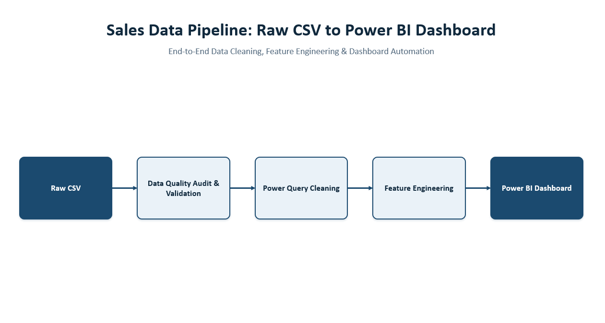
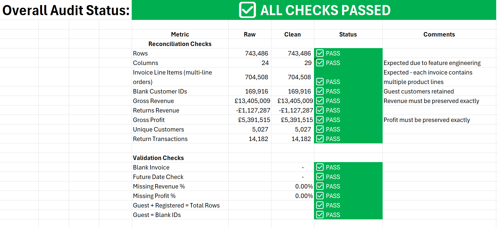
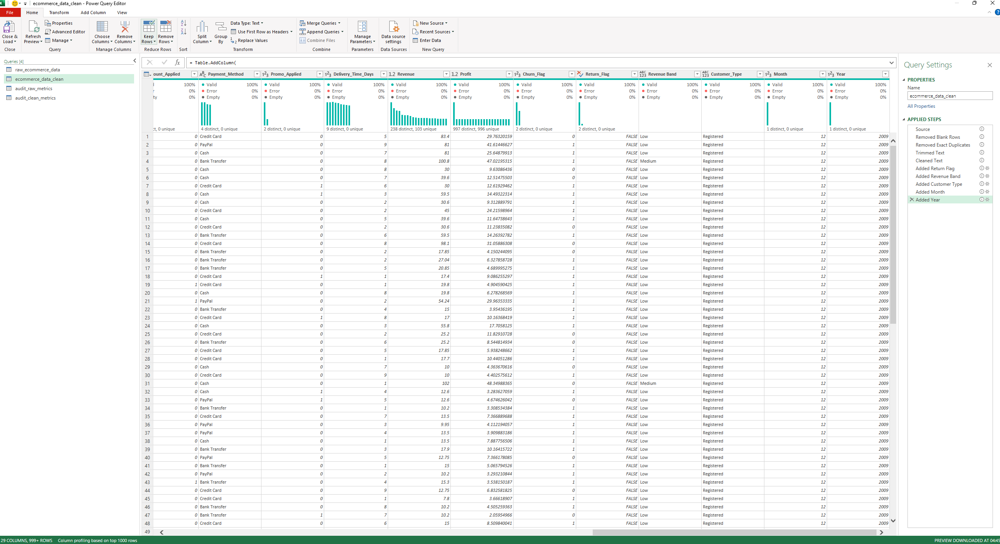
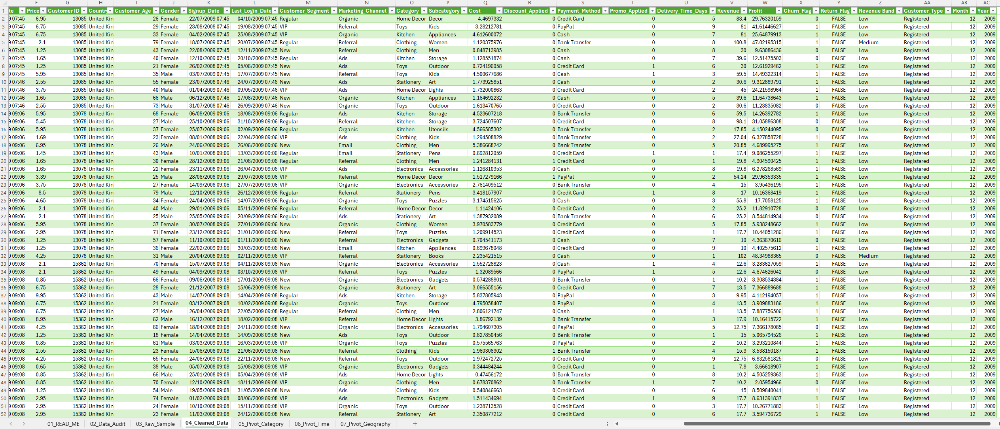
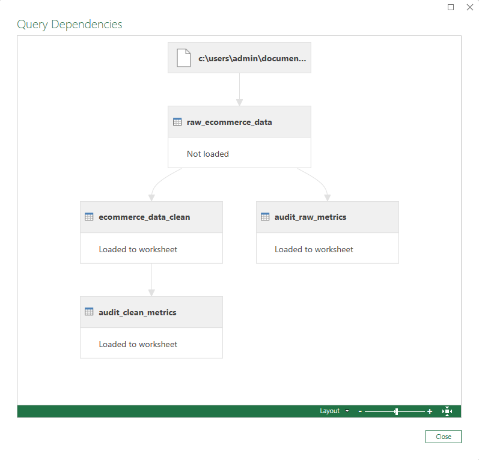
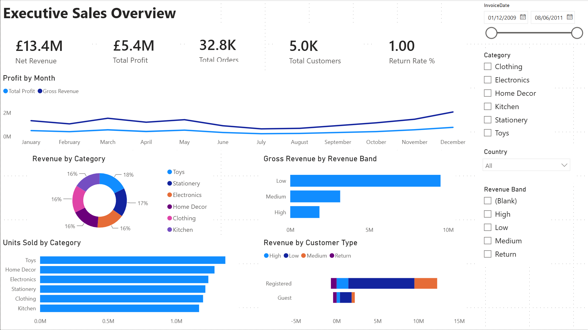

# Excel Data Quality Framework



## Overview

This project demonstrates an end-to-end Excel-based data quality framework for cleaning, validating and preparing retail transaction data for business intelligence reporting. Using Microsoft Excel and Power Query, a raw e-commerce dataset was profiled, transformed and validated through a structured audit process before being exported to Power BI for visualisation.

Rather than simply cleaning the data, the project focuses on understanding the business context behind data quality issues, preserving legitimate transactions and verifying that key business metrics remain unchanged after transformation. The resulting framework provides a reusable template for future Excel ETL and data validation projects.

---

## Business Problem

Business reporting is only as reliable as the underlying data. Before analysis can begin, datasets must be assessed for completeness, consistency and integrity while ensuring that valid business transactions are not unintentionally removed.

The objectives of this project were to:

- Assess the quality of a large retail transaction dataset.
- Build a repeatable Power Query ETL workflow.
- Create a structured data audit process comparing raw and cleaned datasets.
- Engineer analytical features for downstream reporting.
- Produce a validated, analysis-ready dataset for Power BI.

---

## Dataset

**Dataset:** E-Commerce Sales, Customer & Churn (2009–2011)

The dataset contains approximately **743,000 retail transaction records** between 2009 and 2011 together with customer demographics, product information and profitability measures.

### Key fields

- Invoice
- Customer ID
- Stock Code
- Product Description
- Quantity
- Revenue
- Profit
- Country
- Customer Demographics
- Marketing Channel

---

## Data Preparation

The complete ETL process was developed in **Power Query**.

### Data Quality Assessment

Before applying any transformations, the dataset was profiled to assess:

- Dataset dimensions
- Date range
- Missing values
- Duplicate records
- Customer completeness
- Product completeness
- Revenue integrity
- Profit integrity
- Return transactions

A reusable audit framework was developed to compare raw and cleaned datasets and verify that business metrics remained consistent after transformation.



### Data Cleaning

Power Query transformations included:

- Assigning appropriate data types
- Removing completely blank rows
- Removing exact duplicate records
- Trimming whitespace
- Removing hidden characters
- Standardising text values
- Validating numeric fields
- Preserving legitimate return transactions
- Preserving guest customer transactions with missing Customer IDs



### Feature Engineering

Additional analytical fields were created to support reporting and segmentation:

- Customer Type (Registered / Guest)
- Return Flag
- Revenue Band
- Invoice Month
- Invoice Year



### Validation

The cleaned dataset was reconciled against the raw dataset using automated validation checks including:

- Row reconciliation
- Column reconciliation
- Revenue reconciliation
- Profit reconciliation
- Duplicate assessment
- Missing value assessment
- Customer classification validation
- Return validation



---

## Results

The validation process confirmed that the dataset was suitable for downstream analysis while preserving business integrity.

### Key Results

| Metric | Result |
|--------|-------:|
| Transaction Records | **743,486** |
| Analysis Period | **2009–2011** |
| Gross Revenue | **£13.41M** |
| Gross Profit | **£5.39M** |
| Guest Customer Transactions Retained | **169,916** |
| Business Metrics Reconciled | ✅ |
| Return Transactions Preserved | ✅ |
| Duplicate Handling Validated | ✅ |

### Key Findings

- Missing Customer IDs represented legitimate guest purchases rather than invalid records.
- Negative revenue and profit values represented customer returns and were intentionally retained.
- Business metrics were fully reconciled before and after transformation.
- Data quality improvements were achieved through standardisation and feature engineering rather than deleting valid transactions.
- A reusable Excel data quality framework was created for future ETL projects.

---

## Technologies

### Microsoft Excel

- Structured Tables
- Named Ranges
- Data Validation
- Lookup Functions

### Power Query

- ETL Pipeline
- Data Profiling
- Data Cleaning
- Feature Engineering
- Query Dependencies
- Data Validation

### Business Intelligence

- Data Quality Framework
- Data Reconciliation
- Analysis-Ready Dataset Preparation

---

## Repository Structure

```text
excel-data-quality-framework/
│
├── data/
│   └── raw_ecommerce_sample.csv
│   └── cleaned_ecommerce_sample.csv
│
├── excel/
│   └── excel_cleaning_sample.xlsx
│
├── powerbi/
│   └── Ecommerce_Sales_Dashboard.pbix
│
├── images/
│   ├── project-workflow.png
│   ├── data-audit-overview.png
│   ├── power-query-transformations.png
│   ├── cleaned-data-preview.png
│   ├── query-dependencies.png
│   └── powerbi-dashboard-preview.png
│
└── README.md
```

---

## Power BI Dashboard

The validated dataset produced by this project was exported to Power BI to develop an interactive business intelligence dashboard analysing sales performance, profitability, customer behaviour and product trends.



---

## Next Project

➡️ **E-commerce SQL BI Analysis**

Building on the validated dataset created in this project, the next stage recreates the transformation process using PostgreSQL before performing advanced SQL analysis, KPI calculations, window functions and Power BI dashboard development.

**Repository:**

https://github.com/pahenda-analytics/ecommerce-sql-bi-analysis

---
